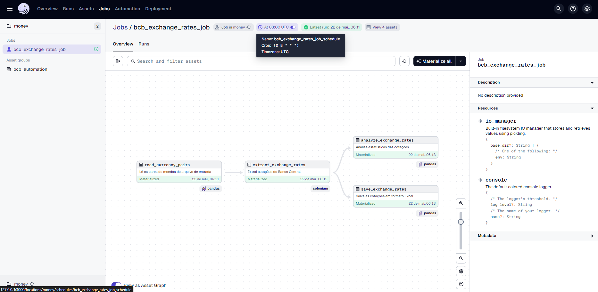
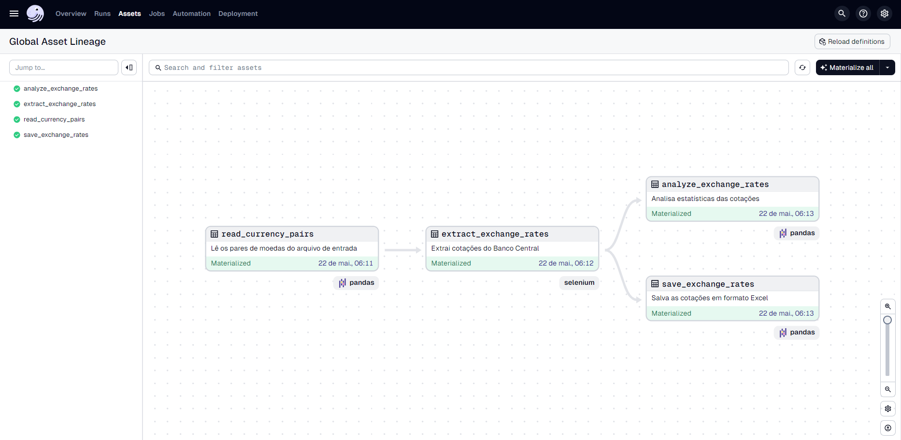
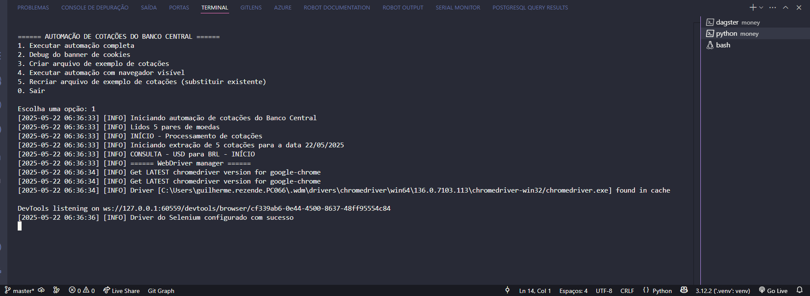
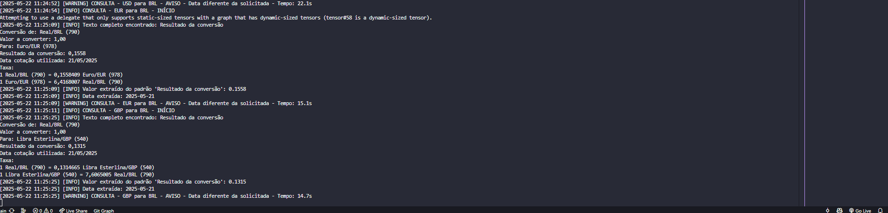
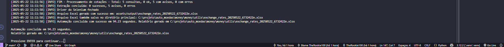

<h1 align="center">Sistema de Automação de Cotações do Banco Central (BCB)</h1>

<p align="center">
<i>Solução completa para automação da consulta de cotações de moedas no site do Banco Central do Brasil</i>
</p>

## Sumário
- Visão Geral
- Problema Abordado
- Arquitetura da Solução
- Fluxo de Funcionamento
- Estrutura do Projeto
- Componentes Principais
- Uso do Dagster como Orquestrador
- Implementações Disponíveis
- Requisitos e Instalação
- Configuração do Projeto
- Execução e Agendamento
- Tratamento de Erros
- Sistema de Logs
- Boas Práticas Implementadas
- Considerações Finais

## Visão Geral do Projeto

<p align="center">
  
</p>

O projeto automatiza a consulta de cotações de moedas no site do Banco Central do Brasil para facilitar o processo de compra de medicamentos importados. A automação substitui um processo manual e propenso a erros, garantindo dados atualizados e precisos para o sistema ERP da empresa.

### Objetivos Principais
1. Eliminar o trabalho manual de consulta de cotações
2. Reduzir erros de digitação e transcrição
3. Garantir a atualização diária das cotações
4. Aumentar a satisfação dos usuários internos com informações atualizadas

## Problema Abordado

A empresa enfrenta os seguintes desafios:
- Trabalho manual na pesquisa das cotações diárias
- Erros de digitação nas múltiplas moedas cadastradas 
- Demora na atualização das informações por ser um processo manual
- Insatisfação dos usuários internos do faturamento pela desatualização de valores

## Arquitetura da Solução

```
┌───────────────────┐     ┌───────────────────┐     ┌───────────────────┐
│                   │     │                   │     │                   │
│  Arquivo Excel    │────▶│  Orquestrador     │────▶│  Extrator de      │
│  de Parâmetros    │     │  Dagster          │     │  Cotações BCB     │
│                   │     │                   │     │  (Selenium/Scrapy)│
└───────────────────┘     └───────────────────┘     └─────────┬─────────┘
                                                              │
                                                              │
                                                              ▼
┌───────────────────┐     ┌───────────────────┐     ┌───────────────────┐
│                   │     │                   │     │                   │
│  Relatório Excel  │◀────│  Processador      │◀────│  Site do          │
│  + Arquivo de Log │     │  de Resultados    │     │  Banco Central    │
│                   │     │                   │     │                   │
└───────────────────┘     └───────────────────┘     └───────────────────┘
```

### Tecnologias Utilizadas
- **Python**: Linguagem de programação principal
- **Dagster**: Orquestrador de fluxos de dados
- **Selenium**: Para consulta automatizada ao site do BCB (implementação principal)
- **Scrapy**: Alternativa para extração de dados (implementação secundária)
- **Pandas**: Manipulação de dados e arquivos Excel
- **Logging**: Sistema de logs formatados conforme requisitos

## Fluxo de Funcionamento

### 1. Leitura de Parâmetros
- O sistema lê um arquivo Excel configurável (`currencies.xlsx`)
- Obtém pares de moedas (origem e destino) para consulta
- Valida os dados de entrada

### 2. Consulta ao Site do Banco Central
<p align="center">
  
</p>

- Para cada par de moedas:
  - Acessa o site https://www.bcb.gov.br/conversao
  - Preenche moeda de origem e destino
  - Insere valor fixo 1 na taxa de conversão
  - Seleciona a data atual
  - Extrai o valor resultante da conversão

### 3. Processamento dos Dados
- **Arredondamento**: Limita o valor a 3 casas decimais
- **Validação de Data**: Verifica se a data da cotação é a atual
- **Formatação**: Prepara os valores no formato aceito pelo ERP

### 4. Geração de Relatórios
- Cria planilha Excel com resultados organizados
- Gera registro detalhado de logs de execução
- Exibe estatísticas do processamento

## Estrutura do Projeto

A estrutura do projeto foi organizada para melhor integração com Dagster e oferecer múltiplas implementações (Selenium e Scrapy):

```
auto_moedas/
│
├── money/                     # Pacote principal
│   ├── __init__.py
│   ├── assets.py              # Definição dos assets do Dagster
│   ├── definitions.py         # Configuração do Dagster (jobs, schedules)
│   ├── spiders/               # Spiders Scrapy
│   │   ├── __init__.py
│   │   └── moedas_spider.py   # Implementação Scrapy
│   ├── repository.py          # Organização dos repositories para dados
│   ├── utils/                 # Funções utilitárias
│   │   ├── __init__.py
│   │   └── selenium_utils.py  # Implementação Selenium 
│   ├── config.py              # Configurações do projeto
│   └── main.py                # Execução standalone
│   └── img/                   # Imagens do projeto para documentação
│
├── assets/                    # Diretórios para arquivos estáticos
│   ├── input/                 # Arquivos de entrada como currencies.xlsx
│   ├── output/                # Resultados gerados pelo sistema
│   └── screenshots/           # Capturas de tela para debug
│
├── logs/                      # Diretório para logs formatados
│
├── setup.py                   # Setup do projeto
├── README.md
└── requirements.txt
```

## Componentes Principais

### 1. Assets do Dagster (`money/assets.py`)
- Define os quatro assets principais do pipeline:
  - `read_currency_pairs`: Lê os pares de moedas do Excel
  - `extract_exchange_rates`: Consulta as cotações no BCB
  - `analyze_exchange_rates`: Analisa e formata os dados obtidos
  - `save_exchange_rates`: Gera o relatório final em Excel

### 2. Implementação Selenium (`money/utils/selenium_utils.py`)
- Contém a classe `BCBAutomation` que:
  - Configura o driver do Selenium
  - Acessa o site do BCB
  - Realiza preenchimento dos formulários
  - Extrai valores das cotações
  - Gerencia screenshots para debug

### 3. Implementação Scrapy (`money/spiders/moedas_spider.py`)
- Define o spider `MoedasSpider` que:
  - Executa a requisição ao BCB via biblioteca Scrapy
  - Processa o HTML para extrair cotações
  - Gerencia fluxo de consultas como alternativa ao Selenium

### 4. Configuração Dagster (`money/definitions.py`)
- Configura os jobs, schedules e recursos do Dagster
- Define o pipeline de execução e suas dependências
- Configura o agendamento das tarefas

### 5. Sistema de Logs
- Fornece logs formatados conforme especificação
- Registra métricas de cada consulta (tempo, status, valores)
- Gera estatísticas de execução

## Uso do Dagster como Orquestrador

<p align="center">
  
</p>

O Dagster foi escolhido como orquestrador do projeto pelos seguintes motivos:

### Vantagens do Dagster Comprovadas no Projeto

1. **Pipeline Visual e Intuitivo**: 
   - Interface gráfica que mostra o fluxo de dados
   - Permite entender facilmente o fluxo dos assets e suas dependências
   - Visualização das dependências entre componentes

2. **Dados Materializados e Armazenados**: 
   - Cada etapa (asset) gera resultados persistidos
   - Dados intermediários podem ser acessados e reutilizados
   - Permite retomar execuções de onde pararam em caso de falhas

3. **Tolerância a Falhas Incorporada**:
   - Se uma consulta específica falha, o restante do processo continua
   - Execuções podem ser retomadas do ponto de falha
   - Armazena o estado entre execuções

4. **Agendamento Integrado**:
   - Configuração simples de agendamento diário
   - Monitoramento de execuções agendadas
   - Notificações em caso de falhas

<p align="center">
  
</p>

5. **Observabilidade Completa**:
   - Logs estruturados e organizados por execução
   - Métricas de tempo de cada etapa
   - Histórico completo de execuções para auditoria

### Fluxo de Assets no Dagster

O pipeline Dagster implementado segue a seguinte sequência:

```
read_currency_pairs → extract_exchange_rates → analyze_exchange_rates → save_exchange_rates
```

1. **read_currency_pairs**:
   - Lê o arquivo Excel com pares de moedas
   - Valida os dados de entrada
   - Retorna um DataFrame com os pares a serem consultados

2. **extract_exchange_rates**:
   - Recebe como entrada o DataFrame de pares de moedas
   - Para cada par, executa a consulta ao BCB (via Selenium ou Scrapy)
   - Retorna um DataFrame com todas as cotações obtidas

3. **analyze_exchange_rates**:
   - Recebe como entrada o DataFrame de cotações
   - Analisa, processa e formata os dados obtidos
   - Prepara os dados para o relatório final

4. **save_exchange_rates**:
   - Recebe como entrada o DataFrame processado
   - Gera o arquivo Excel final
   - Retorna o caminho do arquivo gerado

## Implementações Disponíveis

O projeto oferece duas implementações distintas para a extração de dados do BCB:

### 1. Implementação Selenium (Principal)

A implementação baseada em Selenium automatiza um navegador Chrome para interagir com o site do BCB como um usuário humano faria:

- **Vantagens**:
  - Alta robustez para lidar com JavaScript e elementos dinâmicos
  - Capacidade de capturar screenshots para debug
  - Funciona mesmo com alterações no site que não modifiquem a estrutura visual

- **Como funciona**:
  1. Abre uma instância do Chrome (headless ou visual)
  2. Navega até a página de conversão do BCB
  3. Preenche os campos de formulário (moedas, valor, data)
  4. Clica no botão de conversão
  5. Extrai o resultado da página

### 2. Implementação Scrapy (Alternativa)

A implementação com Scrapy oferece uma abordagem mais leve, utilizando requisições HTTP diretas:

- **Vantagens**:
  - Execução mais rápida
  - Menor consumo de recursos
  - Possibilidade de paralelização de requisições

- **Como funciona**:
  1. Envia requisição HTTP para a página de conversão
  2. Submete o formulário via POST com os pares de moedas
  3. Processa o HTML resultante para extrair os valores
  4. Passa para o próximo par de moedas

### Como Alternar Entre as Implementações

Para alternar entre as implementações, use o parâmetro de configuração no arquivo `config.py`:

```python
# Definir qual implementação usar: "selenium" ou "scrapy"
IMPLEMENTATION = "selenium"  # ou "scrapy"
```

Alternativamente, ao executar via linha de comando:

```bash
# Para usar Selenium (padrão)
python -m money.main

# Para usar Scrapy
python -m money.main --implementation scrapy
```

## Requisitos e Instalação

### Requisitos
- Python 3.9+
- Google Chrome instalado (para implementação Selenium)
- Acesso à internet para consultar o site do BCB

### Instalação

1. **Clone o repositório**:
   ```bash
   git clone https://github.com/TheRookie100/auto_moedas.git
   cd auto_moedas
   ```

2. **Crie e ative um ambiente virtual**:
   ```bash
   python -m venv .venv
   
   # No Windows:
   .venv\Scripts\activate
   
   # No Linux/Mac:
   source .venv/bin/activate
   ```

3. **Instale as dependências**:
   ```bash
   pip install -r requirements.txt
   pip install -e .  # Instala o projeto em modo desenvolvimento
   ```

## Configuração do Projeto

### 1. Arquivo de Parâmetros

Crie ou edite o arquivo Excel em `assets/input/currencies.xlsx` com a seguinte estrutura:

| Moeda Origem | Moeda Destino |
|-------------|--------------|
| USD         | BRL          |
| EUR         | BRL          |
| GBP         | BRL          |
| BRL         | USD          |
| ...         | ...          |

### 2. Configuração do Dagster

O arquivo `money/definitions.py` contém as configurações do Dagster:

```python
# Exemplo simplificado das definições Dagster
@asset
def read_currency_pairs():
    # Lê e retorna os pares de moedas
    ...

@asset
def extract_exchange_rates(read_currency_pairs):
    # Extrai cotações para os pares de moedas
    ...

@asset
def analyze_exchange_rates(extract_exchange_rates):
    # Analisa e processa os dados obtidos
    ...

@asset
def save_exchange_rates(analyze_exchange_rates):
    # Gera o relatório final
    ...

# Definição do job que executa todos os assets em sequência
bcb_exchange_rates_job = define_asset_job(
    "bcb_exchange_rates_job",
    selection=AssetSelection.all()
)

# Agendamento diário às 8h UTC
daily_schedule = ScheduleDefinition(
    job=bcb_exchange_rates_job,
    cron_schedule="0 8 * * *"
)

# Definição do repositório Dagster
defs = Definitions(
    assets=[read_currency_pairs, extract_exchange_rates, analyze_exchange_rates, save_exchange_rates],
    jobs=[bcb_exchange_rates_job],
    schedules=[daily_schedule]
)
```

## Execução e Agendamento

### Execução Standalone (Sem Dagster)

Para executar o projeto manualmente sem usar o Dagster:

```bash
# Navegue até o diretório principal do projeto
cd auto_moedas/money

# Execução do módulo diretamente 
python -m money.main

# OU navegue até o diretório money e execute o main.py
cd money
python main.py
```

<p align="center">
  
</p>

O sistema exibirá um menu interativo com as seguintes opções:

1. **Executar automação completa** - Realiza todo o processo de consulta
2. **Debug do banner de cookies** - Testa a interação com o banner de cookies do site
3. **Criar arquivo de exemplo de cotações** - Gera um arquivo de exemplo
4. **Executar automação com navegador visível** - Executa mostrando o Chrome
5. **Recriar arquivo de exemplo de cotações** - Substitui o arquivo de exemplo existente
0. **Sair** - Encerra o programa

Escolha a opção digitando o número correspondente e pressionando Enter.

### Execução com Dagster

1. **Iniciar o servidor Dagster**:
   ```bash
   cd auto_moedas
   dagster dev
   ```

2. **Acessar a interface web**:
   Abra o navegador em `http://localhost:3000`

3. **Executar o pipeline completo**:
   - Na interface, selecione o job `bcb_exchange_rates_job`
   - Clique em "Launch Run"
   - Acompanhe o progresso em tempo real

<p align="center">
  
</p>


4. **Executar assets individuais**:
   - Na aba "Assets", você pode selecionar assets específicos para execução
   - Útil para testar partes do pipeline isoladamente

### Agendamento Automático

Para configurar a execução automática diária:

1. **Ativar o agendamento**:
   - Na interface Dagster, acesse a aba "Schedules" ou "Automation"
   - Selecione `bcb_exchange_rates_job_schedule`
   - Verifique se o toggle está ativado (azul)
   - Se necessário, clique em "Reset schedule status"

2. **Monitorar execuções agendadas**:
   - Na interface, você pode ver a próxima execução agendada
   - No painel de Jobs, o ícone de relógio indica que o job está agendado

## Tratamento de Erros

O sistema foi projetado para lidar com diversos cenários de erro:

### 1. Implementação Selenium

- **Moeda não encontrada no dropdown**:
  - Implementa múltiplas estratégias de seleção
  - Tenta diferentes seletores CSS/XPath
  - Usa JavaScript como fallback
  - Registra erro detalhado e continua com próxima moeda

- **Elemento não visível ou não clicável**:
  - Implementa scroll para elemento
  - Tenta diferentes abordagens de clique

- **Site indisponível**:
  - Implementa retentativas com backoff exponencial
  - Registra falha após quantidade máxima de tentativas

### 2. Implementação Scrapy

- **Formulário alterado**:
  - Analisa estrutura do HTML para adaptar estratégia
  - Tenta diferentes abordagens de extração

- **Bloqueio de requisição**:
  - Implementa cabeçalhos realistas
  - Rotação de User-Agent
  - Delays entre requisições

### 3. Tratamento Unificado

- **Registro detalhado de erros**:
  - Identifica exatamente qual par de moedas falhou
  - Registra informações detalhadas para diagnóstico
  - Continua processamento das demais moedas

- **Alertas por criticidade**:
  - Erros individuais em moedas são tratados como warnings
  - Falhas sistêmicas geram erros críticos
  - Configuração de limiar de falhas aceitáveis

## Sistema de Logs

O sistema de logs foi implementado conforme as especificações:

### Formato de Log Padronizado

```log
[2025-05-21 21:56:37] [INFO] INÍCIO - Processamento de cotações
[2025-05-21 21:56:37] [INFO] CONSULTA - USD para BRL - INÍCIO
[2025-05-21 21:56:57] [INFO] CONSULTA - USD para BRL - CONCLUÍDO - Tempo: 20.5s - Valor: 0.177
[2025-05-21 21:56:59] [INFO] CONSULTA - EUR para BRL - INÍCIO
[2025-05-21 21:57:15] [INFO] CONSULTA - EUR para BRL - CONCLUÍDO - Tempo: 15.5s - Valor: 0.156

```
<p align="center">
  ]
</p>

<!--
<p align="center">
  
</p>

<p align="center">
  
</p>-->

### Métricas Capturadas

- **Tempo total de execução**: Medido para todo o pipeline e cada etapa
- **Tempo por consulta**: Registrado para cada par de moedas
- **Status de cada consulta**: Sucesso, erro ou aviso
- **Valores obtidos**: Valor da cotação extraída
- **Contadores de estatísticas**: Total de consultas, sucessos, avisos e erros

### Registro de Eventos Importantes

- **Início e fim de processamento**: Marcação clara com timestamps
- **Eventos por moeda**: Registro de início, fim e status de cada consulta
- **Erros técnicos**: Registrados com detalhes para diagnóstico
- **Métricas de desempenho**: Tempos de execução para identificar gargalos

## Boas Práticas Implementadas

### 1. Modularidade e Separação de Responsabilidades
- Assets Dagster separados por função específica
- Implementações Selenium e Scrapy desacopladas
- Separação clara entre extração de dados e processamento

### 2. Tolerância a Falhas
- Continuação do processamento mesmo com falhas individuais
- Registro detalhado para análise posterior
- Retentativas com estratégias adequadas

### 3. Observabilidade
- Logs estruturados e padronizados
- Métricas de tempo e desempenho
- Screenshots de diagnóstico quando necessário

### 4. Manutenibilidade
- Estrutura de projeto organizada
- Documentação inline do código
- README detalhado
- Configurações externalizadas

### 5. Automação e Agendamento
- Execução automática via Dagster
- Monitoramento de execuções
- Histórico para auditoria

## Considerações Finais

O projeto "Auto Moedas" representa uma solução robusta para automatizar a consulta de cotações do Banco Central do Brasil. A utilização do Dagster como orquestrador trouxe benefícios significativos:

### Principais Benefícios do Dagster

1. **Visibilidade e Observabilidade**: Interface gráfica que permite acompanhar o fluxo de dados, identificar gargalos e monitorar execuções.

2. **Resiliência**: Capacidade de retomar processamentos a partir do ponto de falha, sem perder trabalho já realizado.

3. **Escalabilidade**: Facilidade para adicionar novas moedas ou fontes de dados sem refatoração significativa.

4. **Agendamento Integrado**: Eliminando necessidade de configurar agendadores externos como cron.

5. **Materialização de Dados**: Armazenamento intermediário que facilita debug e análise.

### Implementações Complementares

A disponibilidade de duas implementações (Selenium e Scrapy) proporciona flexibilidade conforme o contexto:

- **Selenium**: Mais robusto para sites com muitos elementos dinâmicos
- **Scrapy**: Mais eficiente para processamento em massa

Esta abordagem dual permite escolher a implementação mais adequada conforme necessidades específicas ou mudanças no site do BCB.

### Próximos Passos

O projeto está estruturado para facilmente evoluir com:

1. Inclusão de novas fontes de cotação além do BCB
2. Integração direta com sistemas ERP via API
3. Alertas e notificações em caso de variações significativas nas cotações
4. Dashboard de acompanhamento histórico de taxas

A arquitetura modular e o uso do Dagster como orquestrador garantem que estas evoluções possam ser implementadas de forma incremental e segura.